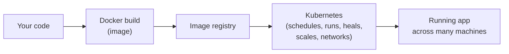

# Chapter 1: Why Kubernetes Exists

[← Back to README](README.md) | Next: [Chapter 2 — Architecture →](02-architecture.md)

You already know Docker. You can build an image, run a container, and wire a few of them together with `docker-compose`. This chapter is about the gap between that and what a real, production, multi-machine system needs — and why Kubernetes is the thing that fills it.

## The problem: containers at scale break in boring, predictable ways

`docker-compose` is great on one machine. The moment your app needs to survive real traffic and real failures, a list of problems shows up that `docker-compose` was never designed to solve:

- **A machine dies.** Every container on it is gone. Who notices? Who restarts them, and where?
- **Traffic grows.** You need more copies of your app. Which machine has spare capacity? Who updates the load balancer?
- **You ship a new version.** How do you replace containers without downtime, and how do you undo it if the new version is broken?
- **Containers need to find each other.** Your API needs to talk to your database. IP addresses change every time a container restarts — how does anything keep track?
- **Secrets and config differ per environment.** You don't want your database password baked into the image.
- **You have more than one machine.** Someone (or something) has to decide *which* machine runs *which* container.

None of this is exotic — it's what "running software in production" has always meant. Kubernetes exists because doing all of this by hand, with scripts and `ssh` and cron jobs, does not scale past a small team or a small app. Kubernetes is **a system that does this bookkeeping for you, continuously, based on a description of what you want.**

## The core idea: declarative, self-healing state

With `docker run` or `docker-compose up`, you tell Docker what to do *right now*: start this container, with this config. It's **imperative**.

Kubernetes flips this around. You tell it the **desired state** — "I want 3 copies of this container running, always" — and a set of background processes (controllers) continuously compare that desired state to what's actually running, and take action to close the gap. This is **declarative** and **self-healing**:

- A Pod crashes → Kubernetes notices and restarts it.
- A whole machine (Node) dies → Kubernetes reschedules its Pods elsewhere.
- You edit the desired replica count from 3 to 10 → Kubernetes starts 7 more, without you touching individual machines.

You're not writing a script that runs once. You're describing a target, and a set of control loops keep chasing it, forever, until you change the target.

## Mapping what you know from Docker

| Docker / docker-compose concept | Closest Kubernetes concept | Key difference |
|---|---|---|
| A running container | A container inside a **Pod** | In Kubernetes you almost never manage a bare container directly — you manage Pods |
| A `docker-compose.yml` service with `replicas` | A **Deployment** | A Deployment actively re-creates Pods that die or get replaced; compose's restart policy is far more limited |
| Containers on the same `docker-compose` network reaching each other by service name | A **Service** + cluster DNS | Kubernetes Services provide a stable IP/DNS name in front of Pods whose IPs constantly change |
| `docker-compose`'s co-located containers (e.g., an app + a sidecar log shipper) | A **Pod** with multiple containers | A Pod is Kubernetes's unit of co-location and shared networking/storage — closer to "one compose service's set of tightly-coupled containers" than to a whole compose file |
| `.env` file / compose `environment:` | **ConfigMaps** and **Secrets** | Kubernetes separates config/secrets from the image and injects them at runtime, cluster-wide, not just per compose file |
| A named Docker volume | A **PersistentVolume** / **PersistentVolumeClaim** | Kubernetes abstracts *where* storage physically lives from *how* a Pod asks for it |
| One Docker host | A **cluster** of many Nodes | Kubernetes decides which Node runs which Pod; you stop thinking machine-by-machine |

The single most important shift: **`docker-compose` describes containers on one host. Kubernetes describes a desired state across an entire fleet of machines, and enforces it continuously.**

## Docker vs. Kubernetes: what each one is actually for

This is a common point of confusion, so let's be direct about it:

- **Docker** builds container images and can run them. It's a *container runtime and tooling ecosystem*.
- **Kubernetes** doesn't replace Docker's job of building/running a single container — it **orchestrates many containers across many machines**: scheduling, scaling, networking, self-healing, rolling updates, and configuration.
- ⚠️ **Currency flag:** Kubernetes dropped direct support for the Docker Engine as a container runtime back in v1.24 (2022) in favor of the Container Runtime Interface (CRI) — runtimes like `containerd` or CRI-O now do the actual container-running underneath Kubernetes. You still build images with Docker; you just don't run production Kubernetes nodes "on Docker" anymore. This is old news by now, but it still confuses people coming from Docker.

In short: **you'll still use Docker (or an OCI-compatible builder) to build images. Kubernetes takes over everything about running, scaling, and healing those images across a cluster.**

## 🧪 Hands-on checkpoint

No cluster yet? No problem — this one just needs a browser.

1. Go to [kubernetes.io](https://kubernetes.io) and open the docs.
2. Search for "Kubernetes Components" and skim the page for two minutes.
3. Notice how many of the terms (Pod, Service, kubelet) are completely new — that's fine, [Chapter 2](02-architecture.md) covers them properly. The goal here is just to see the shape of the vocabulary before we dive in.

## 🎥 Video

**[Kubernetes Explained in 100 Seconds](https://www.youtube.com/watch?v=PziYflu8cB8)** — Fireship (2:07)
A very fast, very dense visual summary of what Kubernetes does and why it exists. Good as a "trailer" before the rest of this chapter's detail sinks in — watch it first or last, either works.

## 💡 Fun facts

- **Kubernetes comes from Google's internal system called Borg.** Many of Kubernetes's original authors had worked on Borg, and a lot of Kubernetes's design (Pods, controllers, declarative state) is a friendlier, open-source descendant of ideas proven there over more than a decade.
- **"K8s" is a numeronym**, not an acronym: count the 8 letters between the "K" and the "s" in "Kubernetes" — *ubernete* — and you get K-8-s.
- **The name is Ancient Greek** for "helmsman" or "pilot" (κυβερνήτης, *kybernḗtēs*) — the person who steers a ship. It's also the etymological root of the word "cybernetics." That's also why the ecosystem is full of nautical logos (Helm, the ship's-wheel Kubernetes logo, "Kompose," etc.).
- **Kubernetes's internal Google codename was "Project Seven,"** a reference to the Star Trek character Seven of Nine — a former Borg, playing on Kubernetes's Borg ancestry. That's why the Kubernetes logo's ship wheel has exactly **seven spokes**.

---
[← Back to README](README.md) | Next: [Chapter 2 — Architecture →](02-architecture.md)
