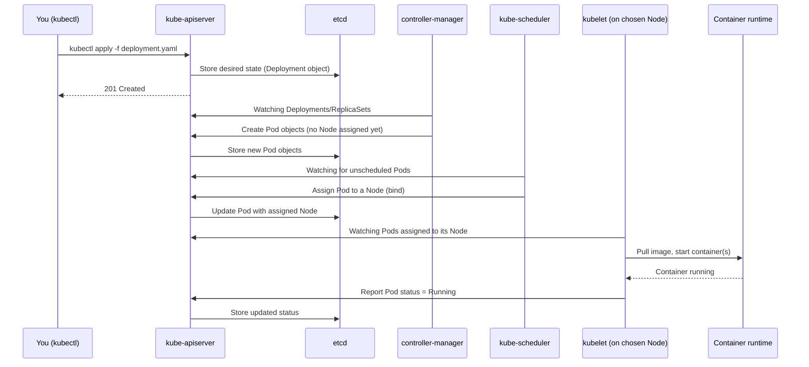

# Chapter 2: Kubernetes Architecture

[← Chapter 1](01-why-kubernetes.md) | [Back to README](README.md) | Next: [Chapter 3 — Core Workload Objects →](03-core-workloads.md)

A Kubernetes **cluster** is a set of machines (**Nodes**) split into two roles: a small number that run the **control plane** (the "brain" — decides what should happen) and a larger number of **worker nodes** (the "muscle" — actually run your containers). This chapter is about what lives in each role, and what actually happens between you typing `kubectl apply` and a container starting somewhere.

## Control plane components

The control plane doesn't run your application containers. Its job is to hold the cluster's desired state and continuously drive the cluster toward it.

- **`kube-apiserver`** — The front door. Every single interaction with the cluster — `kubectl`, controllers, kubelets, dashboards — goes through the API server as an HTTP(S)/REST call. It validates requests and is the only component that talks directly to `etcd`.
- **`etcd`** — A distributed, consistent key-value store. This is where the entire cluster state lives: every object you've created, and its current status. If you lose `etcd` (without backups), you've lost the cluster's memory.
- **`kube-scheduler`** — Watches for newly created Pods that don't yet have a Node assigned, and picks a Node for each one, based on resource requests, constraints, and policies (more in [Chapter 6](06-scheduling-scaling-health.md)).
- **`kube-controller-manager`** — Runs a bundle of **controllers**, each a small control loop watching one type of object and reconciling actual state toward desired state (e.g., the Deployment controller, the Node controller, the Job controller).
- **`cloud-controller-manager`** (if running on a cloud provider) — Talks to the cloud's APIs to do things Kubernetes itself can't, like provisioning a cloud load balancer for a `LoadBalancer` Service.

## Node components

Every worker Node runs the same three things:

- **`kubelet`** — The agent on each Node. It watches the API server for Pods assigned to its Node, and makes sure their containers are actually running and healthy. Think of it as the control plane's local representative on that machine.
- **`kube-proxy`** — Maintains network rules on the Node so that traffic sent to a Service's virtual IP correctly reaches one of the right Pods, wherever they're running.
- **Container runtime** — The software that actually pulls images and runs containers, speaking the Container Runtime Interface (CRI) — commonly `containerd` or CRI-O today.

## From `kubectl apply` to a running Pod

Here's the flow that ties it all together. Say you run `kubectl apply -f deployment.yaml`:



Notice the pattern: **nothing talks to anything else directly.** The scheduler doesn't tell the kubelet what to do. The controller manager doesn't talk to the scheduler. Everything reads and writes through the API server, and everyone else finds out about changes by *watching* the API server for the objects they care about. This "everyone watches the API server" pattern is why Kubernetes is so extensible — anything can plug in as long as it speaks the API.

## 🧪 Hands-on checkpoint

If you already have `kubectl` and access to any cluster (even a temporary one from [Chapter 8](08-hands-on-lab.md)), run:

```bash
kubectl get componentstatuses 2>/dev/null || kubectl get nodes -o wide
kubectl cluster-info
```

`kubectl cluster-info` shows you where the control plane is actually running — useful the first time you connect to an unfamiliar cluster (managed clusters like EKS/GKE/AKS usually hide the control plane machines from you entirely, which is part of what "managed" means — more in [Chapter 10](10-ecosystem-and-whats-next.md)).

## 🎥 Video

**[Kubernetes Explained in 6 Minutes | k8s Architecture](https://www.youtube.com/watch?v=TlHvYWVUZyc)** — ByteByteGo (6:28)
A tight, diagram-driven walkthrough of exactly the control-plane/node split covered above — good as reinforcement right after reading this chapter.

## 💡 Fun facts

- **`etcd`'s name comes from Unix's `/etc` folder** (traditional home of system configuration files) plus "d" for "distributed" — it's meant to evoke "a distributed `/etc`" for the whole cluster.
- **Kubernetes is written in Go**, even though its ancestor Borg was written in C++ — a deliberate choice by the original authors to use a modern, simpler systems language when they rebuilt the ideas as an open-source project.
- **The API server is the *only* component allowed to talk to `etcd` directly.** Every other component — even ones written by Google or the CNCF — has to go through the same public API that your `kubectl` commands use. There's no special back door.

---
[← Chapter 1](01-why-kubernetes.md) | [Back to README](README.md) | Next: [Chapter 3 — Core Workload Objects →](03-core-workloads.md)
