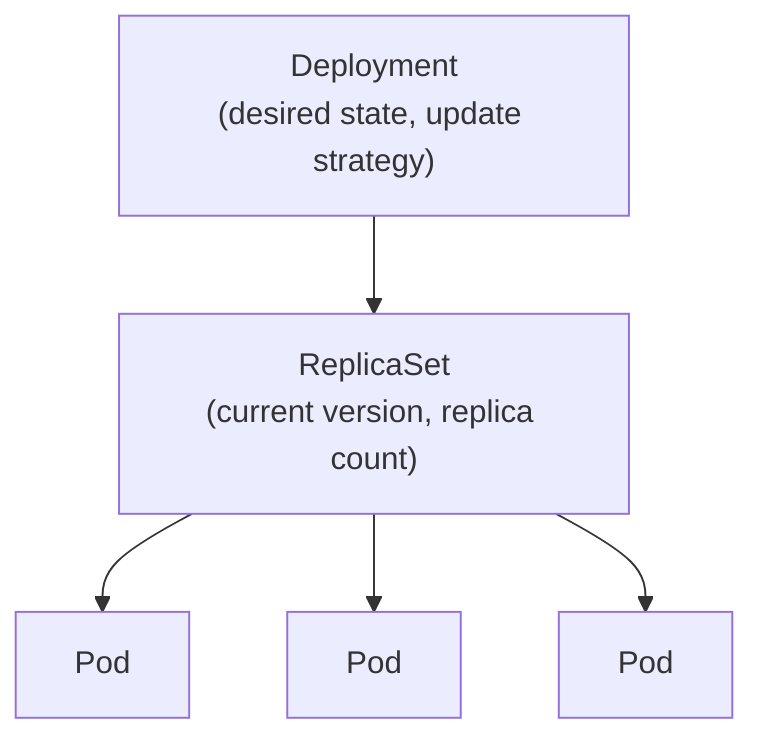

# Chapter 3: Core Workload Objects

[← Chapter 2](02-architecture.md) | [Back to README](README.md) | Next: [Chapter 4 — Networking Deep Dive →](04-networking-deep-dive.md)

This chapter covers the objects you'll actually create day to day: the different ways to run containers in Kubernetes, and when each one is the right tool.

## Pod

A **Pod** is the smallest deployable unit in Kubernetes — one or more containers that are always scheduled together, on the same Node, sharing the same network namespace (so they can reach each other on `localhost`) and optionally shared storage volumes.

If you've used `docker-compose` to run a main app container alongside a tightly-coupled helper (a log shipper, a proxy sidecar), that pairing is roughly what a multi-container Pod is for. It's **not** the same as an entire `docker-compose.yml` — a Pod is for containers that genuinely need to live and die together; unrelated services still get their own Pods.

You'll rarely create bare Pods directly in real use. Almost always, something else manages Pods on your behalf — which is the rest of this chapter.

## ReplicaSet

A **ReplicaSet** ensures a specified number of identical Pod replicas are running at all times. If a Pod dies, the ReplicaSet notices and creates a replacement. You'll almost never create a ReplicaSet directly either — it's mostly a building block that a Deployment manages for you.

## Deployment

A **Deployment** is what you'll use for the large majority of your stateless workloads. It manages ReplicaSets on your behalf and adds the things you actually want day to day:

- Declarative updates: change the container image version, and the Deployment handles rolling out new Pods and retiring old ones.
- Rollback: revert to a previous version if something breaks.
- Scaling: change the replica count and it's enforced continuously.



When you update a Deployment's image, it creates a **new** ReplicaSet at the new version and gradually scales it up while scaling the old ReplicaSet down — that's how rolling updates work under the hood (more in [Chapter 9](09-day-to-day-operations.md)).

## StatefulSet

A **StatefulSet** is for workloads that need **stable identity** — a stable network name and stable storage per Pod, even across restarts. Think databases, message queues, anything where "Pod #2" needs to keep being "Pod #2," with the same disk, every time it restarts. Regular Deployments give every Pod a random name and no guaranteed storage continuity; StatefulSets give each Pod a fixed ordinal name (`myapp-0`, `myapp-1`, ...) and (when configured) a PersistentVolumeClaim that follows that specific Pod.

## DaemonSet

A **DaemonSet** ensures exactly one copy of a Pod runs on every Node (or every Node matching a selector) — no more, no less, automatically extending to new Nodes as they join the cluster. This is the pattern for infrastructure-level, "one per machine" agents: log collectors, monitoring agents, and CNI networking plugins (see [Chapter 4](04-networking-deep-dive.md)) are usually deployed this way.

## Job and CronJob

A **Job** runs a Pod (or several) to completion — for a one-off task, not a long-running service — and tracks success, retrying on failure up to a limit. A **CronJob** wraps a Job with a schedule, exactly like a Unix cron entry (`0 2 * * *` for "every day at 2am"), for recurring batch work: nightly reports, backups, cleanup tasks.

## Decision table: which one do I use?

| You need to... | Use |
|---|---|
| Run a stateless web app / API that can scale horizontally | **Deployment** |
| Run a database, or anything needing stable identity + per-instance storage | **StatefulSet** |
| Run one instance of something on *every* Node (log agent, node monitor) | **DaemonSet** |
| Run a task once and know when it finishes | **Job** |
| Run a task on a recurring schedule | **CronJob** |
| Tightly couple a handful of containers that must share network/storage | **Pod** (usually wrapped in one of the above) |

## 🧪 Hands-on checkpoint

If you have access to any cluster already, this shows the Deployment → ReplicaSet → Pod chain live:

```bash
kubectl create deployment demo --image=nginx --replicas=2
kubectl get deployments,replicasets,pods
```

Notice the ReplicaSet's name is the Deployment's name plus a hash, and each Pod's name is the ReplicaSet's name plus another hash — that's the parent/child chain from the diagram above, visible in the names themselves. Clean up when done: `kubectl delete deployment demo`.

## 🎥 Video

**[Kubernetes Components explained! Pods, Services, Secrets, ConfigMap](https://www.youtube.com/watch?v=Krpb44XR0bk)** — TechWorld with Nana (18:12)
Walks through most of the core objects (Pod, Deployment, StatefulSet, and more) using a real demo app, which is a good way to see how they fit together in practice rather than in isolation.

## 💡 Fun facts

- **A Deployment never touches Pods directly** — it only ever manages ReplicaSets, which manage Pods. That extra layer of indirection is what makes rolling updates possible: the old and new ReplicaSets can briefly coexist during a rollout.
- **CronJob's schedule syntax is exactly standard Unix cron syntax** (five fields: minute, hour, day-of-month, month, day-of-week) — if you've ever written a crontab entry, you already know it.

---
[← Chapter 2](02-architecture.md) | [Back to README](README.md) | Next: [Chapter 4 — Networking Deep Dive →](04-networking-deep-dive.md)
