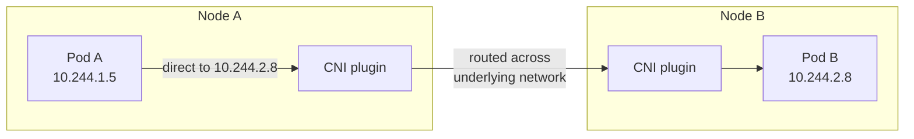
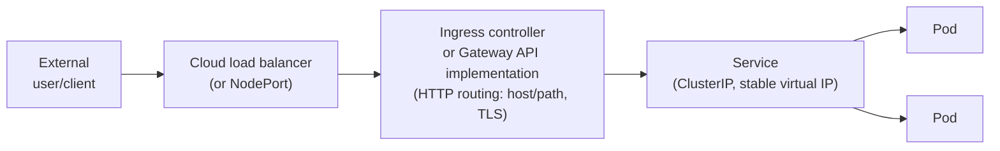

# Chapter 4: Networking Deep Dive

[← Chapter 3](03-core-workloads.md) | [Back to README](README.md) | Next: [Chapter 5 — Configuration & Storage →](05-config-and-storage.md)

Networking is where a lot of Kubernetes's real complexity lives, and it's also an area that's genuinely changing right now — so this chapter is longer than most, and includes an explicit note on what's current versus what's legacy.

## The cluster networking model: every Pod gets an IP

Kubernetes networking starts from one simple, deliberately-chosen rule: **every Pod gets its own IP address, and every Pod can reach every other Pod's IP directly, without NAT** — regardless of which Node either one is running on. This is very different from Docker's default networking, where containers on different hosts can't reach each other without you explicitly setting up something (an overlay network, port mapping, a service mesh, etc.).

This "flat network" model is what lets Kubernetes treat the whole cluster as one address space. The tradeoff is that *something* has to actually make that flat network real across potentially hundreds of physical or virtual machines — which brings us to CNI.

## CNI plugins: who makes the flat network real

Kubernetes itself does **not** implement pod-to-pod networking. It defines an interface — the **Container Network Interface (CNI)** — and delegates the actual work to a pluggable CNI provider, installed as an add-on (commonly as a DaemonSet, see [Chapter 3](03-core-workloads.md)). Popular choices include Cilium, Calico, and Flannel.

At a conceptual level, a CNI plugin's job is to:

- Assign an IP address to each new Pod from the cluster's Pod IP range.
- Set up the actual routing (often via an overlay network, or via direct routing/BGP on more advanced plugins) so that Pod IPs are reachable cluster-wide.
- Optionally enforce **NetworkPolicies** (see [Chapter 7](07-kubernetes-security-basics.md)) — not every CNI plugin supports this, which matters a lot for security.

You generally don't need to compare CNI vendors in depth to work with Kubernetes day to day — just know that this layer exists, that it's swappable, and that it's the thing making "every Pod gets an IP" actually true.

### Pod-to-pod communication across Nodes



Pod A addresses Pod B by its Pod IP directly. Neither Pod needs to know or care which physical Node the other is on, or that a network hop across machines just happened — the CNI plugin makes that transparent.

## Why Pod IPs alone aren't enough: Services

Pod IPs are not stable — Pods get replaced constantly (crashes, rollouts, rescheduling), and each replacement gets a *new* IP. You can't hardcode a Pod IP anywhere and expect it to keep working. A **Service** solves this: it's a stable virtual IP and DNS name in front of a changing set of Pods, selected by label.

| Service type | What it does | Typical use |
|---|---|---|
| **ClusterIP** (default) | A stable virtual IP reachable only from *inside* the cluster | Internal service-to-service traffic (e.g., your API talking to your database) |
| **NodePort** | Opens the same static port on *every* Node's IP, forwarding to the Service | Quick/manual external access, dev and testing, or as a building block under an Ingress/LoadBalancer |
| **LoadBalancer** | Asks the cloud provider (via `cloud-controller-manager`, see [Chapter 2](02-architecture.md)) to provision an external cloud load balancer pointing at the Service | Production external access on a cloud platform |

Under the hood, `kube-proxy` on every Node maintains the packet-forwarding rules so that traffic sent to a Service's virtual IP gets load-balanced across the currently-healthy Pods backing it — this is exactly how a Service stays stable while the Pods behind it come and go.

## Getting HTTP/HTTPS traffic in: Ingress vs. the Gateway API

A `LoadBalancer` Service gets you one external IP per Service — fine for a handful of services, expensive and unwieldy for dozens, and it doesn't give you HTTP-level routing (paths, hostnames, TLS termination) on its own. That's the job of a layer above Services, for routing HTTP/HTTPS traffic by hostname and path to different backend Services behind a single entry point.

**⚠️ Currency flag — this is actively changing, and it's worth being precise about it:**

- For years, the standard way to do this was the **`Ingress`** API object, almost always implemented by the **`ingress-nginx`** controller.
- **`ingress-nginx` was retired in March 2026.** Best-effort maintenance stopped, the GitHub repository was archived, and no further security patches will be issued. This followed a critical, actively-exploited vulnerability (CVE-2025-1974, "IngressNightmare") and several more high-severity CVEs found in the controller in the months before retirement.
- The Kubernetes project's own recommendation is to migrate to the **Gateway API** — a newer, more expressive, role-oriented set of CRDs (`GatewayClass`, `Gateway`, `HTTPRoute`, and more) that fixes several structural problems with `Ingress` (vendor-specific annotation sprawl, no separation between "infra owner," "cluster operator," and "app developer" roles, and HTTP-only routing).

**What this means in practice, as of this writing:**

- **The Gateway API is the modern default for new clusters** and the CNCF-recommended path going forward. Implementations include Envoy Gateway, Cilium, and others.
- **Classic `Ingress`** (with a non-`ingress-nginx` controller, since that one is dead — e.g., Traefik, HAProxy, or a cloud provider's native controller) is still very common in **existing** environments, and you will absolutely still encounter `Ingress` YAML at work. Don't be surprised by it — just know it's the legacy path, not the one to reach for on a brand-new cluster.
- If you're setting up routing for a new project today, start with the Gateway API. If you're maintaining an existing cluster, you'll likely be working with `Ingress` until (or unless) it's migrated.

### External traffic → a Pod, through a Service and an Ingress/Gateway



The Ingress/Gateway layer decides *which Service* a request goes to based on hostname/path; the Service then load-balances across whichever Pods currently match its label selector. Two layers of indirection, each solving a different problem — this is worth sitting with, because it trips people up.

## DNS inside the cluster

Kubernetes runs a cluster-internal DNS server (commonly **CoreDNS**) as an add-on. Every Service automatically gets a DNS name of the form:

```
<service-name>.<namespace>.svc.cluster.local
```

So from any Pod, you can reach a Service called `payments` in the `billing` namespace at `payments.billing.svc.cluster.local` — or just `payments` if you're in the same namespace, thanks to DNS search-domain defaults. This is the direct equivalent of `docker-compose`'s "reach another service by its compose service name" — except it works cluster-wide, across namespaces, not just within one compose file.

## 🧪 Hands-on checkpoint

If you have a cluster available:

```bash
kubectl create deployment web --image=nginx
kubectl expose deployment web --port=80 --type=ClusterIP
kubectl get svc web
kubectl run tmp-shell --rm -it --image=busybox -- wget -qO- web
```

That last command runs a temporary Pod and uses cluster DNS to resolve and hit the `web` Service by name — a live demonstration of the DNS section above. Clean up with `kubectl delete deployment web && kubectl delete svc web`.

## 🎥 Videos

**[Kubernetes Explained in 100 Seconds](https://www.youtube.com/watch?v=PziYflu8cB8)** — Fireship (2:07) *(revisit from Chapter 1)*
If it's been a couple of chapters since you watched this, a quick rewatch now — with Services and networking freshly in mind — tends to land differently the second time.

*A dedicated short video specifically on the Gateway API vs. Ingress transition wasn't something this course could verify as both currently live and under 20 minutes at the time of writing — search "Gateway API vs Ingress" on YouTube for current options, and prefer anything published in 2026 given how recent this transition is.*

## 💡 Fun facts

- **The "no-NAT, flat network" requirement is written into the Kubernetes networking model itself** — any CNI plugin has to satisfy it to be considered compliant, which is why you can swap CNI plugins without changing how your application code addresses other Pods.
- **`ingress-nginx`'s retirement was reportedly a big deal precisely because of how popular it was** — industry estimates cited around half of all Kubernetes clusters using it at the time of the announcement, which is part of why the Gateway API migration became such a widely-discussed topic in 2026.

---
[← Chapter 3](03-core-workloads.md) | [Back to README](README.md) | Next: [Chapter 5 — Configuration & Storage →](05-config-and-storage.md)
