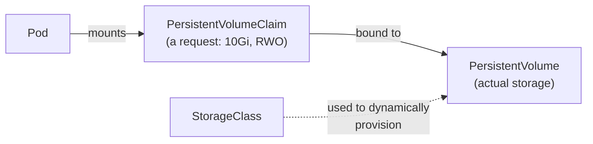

# Chapter 5: Configuration & Storage

[← Chapter 4](04-networking-deep-dive.md) | [Back to README](README.md) | Next: [Chapter 6 — Scheduling, Scaling & Health →](06-scheduling-scaling-health.md)

Your containers need configuration and, sometimes, persistent storage — Kubernetes gives you dedicated objects for both, so you're not baking either into the image.

## ConfigMaps

A **ConfigMap** holds non-sensitive configuration data as key-value pairs, which you can inject into Pods as environment variables or as mounted files. This is the direct equivalent of a `docker-compose` `environment:` block or a `.env` file, except it's a first-class, cluster-managed object you can create once and reuse across many Pods — and update independently of the image.

## Secrets — and their real limitations

A **Secret** looks and behaves like a ConfigMap, but is intended for sensitive data: passwords, API keys, tokens, TLS certificates.

**Be clear-eyed about what a built-in Secret actually protects you from, because this genuinely trips people up:**

- Kubernetes Secrets are stored **base64-encoded, not encrypted**, by default. Base64 is an *encoding*, not encryption — anyone who can read the Secret object (via the API, or by reading `etcd` directly) can trivially decode it. `echo <value> | base64 -d` undoes it instantly.
- Encryption of Secrets at rest in `etcd` is possible, but it's an **optional cluster configuration** (encryption providers), not automatic out of the box.
- Access to Secrets is only as safe as your RBAC configuration (see [Chapter 7](07-kubernetes-security-basics.md)) — anyone with `get` permission on Secrets in a namespace can read every credential stored there.

**In short: built-in Kubernetes Secrets are a convenient, standardized *storage and injection mechanism* — not a vault.** For anything genuinely sensitive in a production environment, teams typically layer a real secrets manager underneath or alongside Kubernetes Secrets:

- **HashiCorp Vault** — a dedicated secrets management system, often integrated via a sidecar or CSI driver that injects secrets into Pods without ever storing them as native Kubernetes Secrets.
- **Cloud KMS-backed solutions** — e.g., AWS Secrets Manager, Google Secret Manager, or Azure Key Vault, often paired with an operator or CSI driver that syncs secrets into the cluster.

You don't need to set any of these up for this course — just carry the mental model: **"Kubernetes Secret" ≠ "encrypted" or "access-controlled by default."** More in [Chapter 7](07-kubernetes-security-basics.md).

## Volumes

A **Volume** in Kubernetes is storage attached to a Pod, with a lifecycle tied to that Pod (or, for some volume types, longer). Unlike a bare container's filesystem, a Volume survives container restarts *within the same Pod* — which matters because containers restart far more often than you'd think (crashes, image updates, health-check failures).

Kubernetes supports many Volume types for different needs — from `emptyDir` (temporary, deleted when the Pod is deleted, useful as shared scratch space between containers in a Pod) to volumes backed by real persistent storage, which is where PersistentVolumes come in.

## PersistentVolumes, PersistentVolumeClaims, and StorageClasses

This is the piece with no direct `docker-compose` analog, because compose almost always runs on a single host where "just use a local directory" is enough. Kubernetes needs a more general abstraction because Pods move between machines.

- **PersistentVolume (PV)** — a piece of *actual* storage in the cluster (a cloud disk, an NFS share, etc.), provisioned either ahead of time by a cluster admin, or automatically on demand.
- **PersistentVolumeClaim (PVC)** — a *request* for storage made by a Pod ("I need 10Gi, read-write-once"), which Kubernetes matches (binds) to a suitable PV.
- **StorageClass** — defines *how* to dynamically provision a PV when a PVC asks for one, pointing at a specific underlying storage provisioner (e.g., a particular cloud disk type). This is what makes "just ask for storage and get it, without an admin manually creating a PV first" possible.



The Pod only ever talks to its PVC. It never needs to know *what* is actually backing that storage — a cloud disk, a network filesystem, whatever the StorageClass provisions. That separation is the entire point: it's the same pattern as a Service decoupling "who I talk to" from "which specific Pod is currently there" ([Chapter 4](04-networking-deep-dive.md)), applied to storage instead of networking.

## 🧪 Hands-on checkpoint

If you have a cluster available:

```bash
kubectl create configmap demo-config --from-literal=GREETING=hello
kubectl get configmap demo-config -o yaml
kubectl create secret generic demo-secret --from-literal=PASSWORD=changeme
kubectl get secret demo-secret -o jsonpath='{.data.PASSWORD}' | base64 -d
```

That last line decodes the "secret" back to plain text in one command — a very direct, hands-on demonstration of the base64-is-not-encryption point above. Clean up with `kubectl delete configmap demo-config secret demo-secret`.

## 💡 Fun facts

- **Base64 encoding of Secrets exists purely so arbitrary binary data (like a TLS certificate) can be safely stored as text in `etcd` and the API** — it was never intended as a security measure, even though its presence often gives people a false sense of protection.
- **`emptyDir` volumes are commonly used as a way for two containers in the same Pod to share files** — for example, a main app container writing logs that a sidecar log-shipper container reads from the same mounted directory.

---
[← Chapter 4](04-networking-deep-dive.md) | [Back to README](README.md) | Next: [Chapter 6 — Scheduling, Scaling & Health →](06-scheduling-scaling-health.md)
