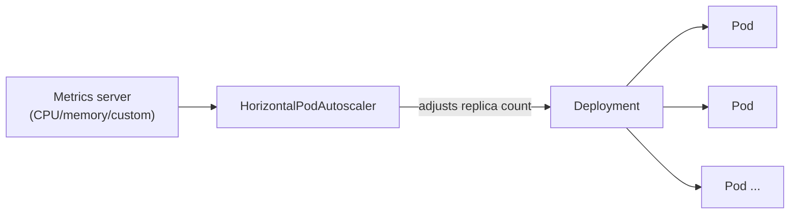

# Chapter 6: Scheduling, Scaling & Health

[← Chapter 5](05-config-and-storage.md) | [Back to README](README.md) | Next: [Chapter 7 — Kubernetes Security Basics →](07-kubernetes-security-basics.md)

This chapter covers how Kubernetes decides a Pod is "healthy," how it decides *where* to run a Pod, and how it grows and shrinks the number of Pods automatically.

## Resource requests and limits

For every container, you can specify:

- **Requests** — the amount of CPU/memory a container is guaranteed to get, and what the scheduler uses to decide which Node has room for it.
- **Limits** — a hard ceiling. Exceed the memory limit and the container is killed (OOMKilled) and restarted. Exceed the CPU limit and the container is throttled, not killed.

Skipping requests/limits entirely is a common beginner mistake: without them, the scheduler has no idea how much room a Pod actually needs, and a single misbehaving Pod can starve every other Pod on its Node. Setting sensible requests/limits is one of the highest-value habits you can build early.

## Probes: how Kubernetes knows a Pod is actually working

A container process staying alive doesn't mean the *application* inside it is working — it might be stuck, deadlocked, or still starting up. Kubernetes uses three types of probes to check:

| Probe | Question it answers | What happens on failure |
|---|---|---|
| **Liveness** | "Is this container still working, or stuck?" | Kubernetes restarts the container |
| **Readiness** | "Is this container ready to receive traffic right now?" | The Pod is removed from the Service's load-balancing pool until it passes again — no restart |
| **Startup** | "Has this (slow-starting) container finished starting up yet?" | Liveness/readiness checks are held off until startup succeeds, avoiding a slow app being killed for "failing" liveness before it ever got a chance to start |

The distinction between liveness and readiness matters a lot in practice: a Pod that's temporarily overloaded and slow to respond should usually fail its *readiness* probe (stop getting new traffic until it recovers) rather than its *liveness* probe (get killed and restarted, which won't fix an overload problem and adds restart churn on top).

## Horizontal Pod Autoscaler (HPA)

The **HorizontalPodAutoscaler** automatically adjusts a Deployment's (or StatefulSet's) replica count based on observed metrics — most commonly average CPU utilization, but it can also use memory or custom/external metrics. You set a target (e.g., "keep average CPU at 60%") and a min/max replica range; the HPA control loop checks metrics periodically and scales up or down to chase that target.

This is "horizontal" scaling — more copies of the Pod — as opposed to "vertical" scaling, which means giving an existing Pod more CPU/memory. Kubernetes has a separate, less commonly used Vertical Pod Autoscaler for that; HPA is what you'll reach for by far the most often.



## Taints, tolerations, and affinity (just enough to recognize them)

You don't need to master these to be productive, but you should recognize the terms when you see them in a manifest or hear them in conversation:

- **Taints** are applied to a *Node*, marking it as unwelcoming to Pods by default (e.g., "this Node is reserved for GPU workloads").
- **Tolerations** are applied to a *Pod*, letting it be scheduled onto a Node with a matching taint anyway — think of a taint as a lock and a toleration as the key.
- **Affinity / anti-affinity** rules express scheduling preferences or requirements based on labels — e.g., "prefer to schedule this Pod near that other Pod" (affinity) or "never schedule two replicas of this Pod on the same Node" (anti-affinity), which is a common way to improve real fault tolerance.

## 🧪 Hands-on checkpoint

If you have a cluster available:

```bash
kubectl create deployment demo --image=nginx --replicas=1
kubectl set resources deployment demo -c=nginx --requests=cpu=50m,memory=64Mi --limits=cpu=100m,memory=128Mi
kubectl describe pod -l app=demo | grep -A3 "Limits\|Requests"
```

This sets and then confirms real requests/limits on a running Deployment — the same values a scheduler and the kubelet would actually enforce. Clean up with `kubectl delete deployment demo`.

## 🎥 Video

*A short (≤20 min), independently-verifiable, currently-live video specifically on the Horizontal Pod Autoscaler wasn't something this course could confirm with a stable link at the time of writing — the [official Kubernetes HPA walkthrough docs](https://kubernetes.io/docs/tasks/run-application/horizontal-pod-autoscale-walkthrough/) are a reliable, always-current alternative, and are worth five minutes if you want to see it end to end.*

## 💡 Fun facts

- **Exceeding a CPU limit doesn't kill your container** — CPU is a "compressible" resource (Kubernetes can just throttle it), while memory is not, which is exactly why memory limit violations are fatal (OOMKilled) but CPU limit violations are merely slow.
- **The default HPA check interval is every 15 seconds** — frequent enough that autoscaling usually feels close to real-time for typical web traffic spikes, without hammering the metrics pipeline.

---
[← Chapter 5](05-config-and-storage.md) | [Back to README](README.md) | Next: [Chapter 7 — Kubernetes Security Basics →](07-kubernetes-security-basics.md)
