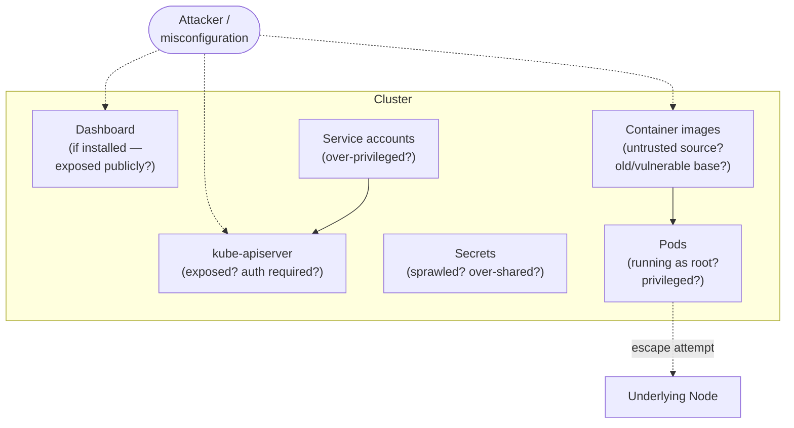

# Chapter 7: Kubernetes Security Basics

[← Chapter 6](06-scheduling-scaling-health.md) | [Back to README](README.md) | Next: [Chapter 8 — Hands-On Lab →](08-hands-on-lab.md)

This chapter maps directly onto the security responsibilities in your new role. The goal is recognition and defensive habits, not exploit development — you should come out of this able to spot risky patterns and know the right Kubernetes mechanism to reach for, not able to attack a cluster.

## The Kubernetes attack surface, at a beginner level

A Kubernetes cluster has more moving, exposed parts than a single application, which means more places things can go wrong. At a high level, the recurring problem areas are:

- **Misconfigured RBAC** — permissions granted more broadly than necessary (a service account with cluster-admin rights when it only needed to read Pods in one namespace).
- **Exposed dashboards and APIs** — the Kubernetes Dashboard or the API server itself reachable from the public internet without proper authentication, which has repeatedly been how real clusters got compromised.
- **Overly permissive service accounts** — every Pod runs as a service account, and by default many clusters historically auto-mounted a service account token into every Pod whether it needed API access or not, handing any compromised container a set of cluster credentials.
- **Secrets sprawl** — credentials copy-pasted into multiple namespaces, ConfigMaps used for things that should be Secrets, or Secrets over-shared to service accounts that don't need them.
- **Container escapes** — a compromised container breaking out of its container boundary to affect the underlying Node, usually enabled by unnecessary privilege (running as root, privileged containers, mounted host paths/sockets).
- **Supply-chain / image risk** — pulling and running images from untrusted sources, or an otherwise-trusted image with an outdated, vulnerable base layer.



Everything else in this chapter is a Kubernetes-native mechanism aimed at one or more of those boxes.

## RBAC fundamentals

**Role-Based Access Control (RBAC)** governs who (or what) can do what, to which resources, in Kubernetes. Four objects, in two pairs:

| Object | Scope | Defines |
|---|---|---|
| **Role** | One namespace | A set of permissions (verbs like `get`, `list`, `create`, `delete` on resources like `pods`, `secrets`) |
| **ClusterRole** | Whole cluster (or reusable across namespaces) | Same idea, cluster-wide scope |
| **RoleBinding** | One namespace | Grants a Role (or ClusterRole) to a specific user, group, or service account, within that namespace |
| **ClusterRoleBinding** | Whole cluster | Grants a ClusterRole cluster-wide |

The governing principle is **least privilege**: grant exactly the verbs and resources a user or service account needs, no more. In practice, this means resisting the shortcut of binding `cluster-admin` to things "to make an error go away" — that's the single most common RBAC misconfiguration in the wild, and it turns any compromise of that identity into a full cluster compromise.

## Secrets management, revisited

[Chapter 5](05-config-and-storage.md) covered the mechanics — here's the security framing: built-in Kubernetes Secrets are base64-encoded, not encrypted, by default, and only as protected as your RBAC rules make them. For genuinely sensitive production credentials, real deployments typically layer a dedicated secrets manager underneath or alongside native Secrets — **HashiCorp Vault**, or a cloud KMS-backed option (AWS Secrets Manager, Google Secret Manager, Azure Key Vault), usually via a sidecar or CSI driver that injects secrets at runtime without storing them as plain Kubernetes Secret objects. You don't need to set one of these up to start this job — just know the built-in mechanism's limits and that this is the standard next step when it matters.

## Network Policies: the security follow-up to Chapter 4

[Chapter 4](04-networking-deep-dive.md) covered the *default* Kubernetes networking model: every Pod can reach every other Pod, flat, with no restrictions. From a security standpoint, that default is wide open — any compromised Pod can potentially probe or reach any other Pod in the cluster.

A **NetworkPolicy** is how you restrict that: a set of rules (like a firewall, scoped to pod labels and namespaces) that controls which Pods may send or receive traffic, and on which ports. A common, high-value pattern is a **default-deny** policy per namespace — block all traffic by default, then explicitly allow only the specific paths your application actually needs (frontend → API, API → database, and nothing else).

⚠️ **Important gotcha:** NetworkPolicies only take effect if your CNI plugin (see [Chapter 4](04-networking-deep-dive.md)) actually implements them — not all do. Writing a NetworkPolicy against a CNI plugin that ignores them silently does nothing; always confirm your cluster's CNI plugin supports NetworkPolicy enforcement.

## Pod Security Standards / Pod Security Admission

Kubernetes previously had a dedicated `PodSecurityPolicy` (PSP) object for enforcing pod-level security rules (no privileged containers, no running as root, etc.). **PSP was deprecated in v1.21 and fully removed in v1.25.**

Its replacement, and the **current mechanism as of this writing**, is **Pod Security Admission (PSA)**, enforcing the **Pod Security Standards** — three predefined profiles applied per namespace via a simple label:

| Profile | Posture |
|---|---|
| **Privileged** | Unrestricted — for trusted, infrastructure-level workloads only |
| **Baseline** | Blocks known privilege-escalation paths, while staying broadly compatible with typical applications |
| **Restricted** | Heavily locked down (no root, no privilege escalation, restricted volume types) — the target for security-sensitive application workloads |

Applying a profile is as simple as labeling a namespace, e.g. `pod-security.kubernetes.io/enforce: restricted` — no separate policy objects, no custom admission webhook required for the basic cases. This built-in simplicity was a deliberate reaction to how complex and hard-to-reason-about PSP had become.

## Image and supply-chain basics

- **Scan images for known vulnerabilities** before and after deployment — tools like Trivy or Grype check image layers against vulnerability databases.
- **Avoid the `latest` tag** in production — it's not reproducible (you can't be sure which actual image is running) and makes rollbacks and audits harder. Pin specific, immutable versions or digests.
- **Prefer minimal base images** (distroless, Alpine, or similar) — fewer packages means a smaller attack surface and fewer things that can have a known vulnerability.
- **Verify image provenance**, conceptually — knowing an image actually came from the source it claims to, and hasn't been tampered with in the registry or in transit. In mature setups this is backed by image signing and admission-time verification; at a beginner level, the habit to build is simply *only pulling images from registries and publishers you actually trust*, and being suspicious of unverified third-party images pulled without review.

## Common real-world Kubernetes misconfigurations

A short, concrete list worth committing to memory:

1. Containers running as root when they don't need to.
2. Overly broad RBAC (`cluster-admin` bindings used as a shortcut).
3. No default-deny NetworkPolicy — flat, unrestricted pod-to-pod traffic left as-is.
4. Secrets stored in ConfigMaps or environment variables in plain manifests committed to source control.
5. The Kubernetes Dashboard (or another admin UI) exposed with no authentication.
6. Using `latest` image tags in production, making it unclear exactly what's running.
7. Privileged containers, or containers with unnecessary host mounts (`hostPath` to sensitive host directories, or the Docker/container-runtime socket).
8. Default service account tokens auto-mounted into Pods that never call the Kubernetes API.

## A safe, legal hands-on option: Kubernetes Goat

If you want to go deeper than this course covers, **[Kubernetes Goat](https://github.com/madhuakula/kubernetes-goat)** is a well-known, intentionally vulnerable cluster environment, purpose-built for practicing exactly the concepts above — RBAC misconfiguration, secrets exposure, container escape scenarios, and more — in a safe, self-contained lab. It's optional and not required for this course; treat it as an "if you want to go deeper" pointer once you're comfortable with the fundamentals above. As with any intentionally-vulnerable environment, only run it in an isolated lab setup, never anywhere near production infrastructure.

## 🧪 Hands-on checkpoint

If you have a cluster available:

```bash
kubectl create namespace secure-demo
kubectl label namespace secure-demo pod-security.kubernetes.io/enforce=restricted
kubectl run bad-pod --image=nginx --privileged -n secure-demo
```

That last command should be **rejected** by Pod Security Admission — a live demonstration of the `restricted` profile actually blocking a privileged Pod. Clean up with `kubectl delete namespace secure-demo`.

## 🎥 Video

*This course could not independently verify a short (≤20 min), currently-live video specifically and accurately covering the current RBAC/Pod Security Admission landscape at the time of writing — the [official Kubernetes RBAC docs](https://kubernetes.io/docs/reference/access-authn-authz/rbac/) and [Pod Security Standards docs](https://kubernetes.io/docs/concepts/security/pod-security-standards/) are the most reliable, always-current references for this chapter, and both are short reads.*

## 💡 Fun facts

- **PodSecurityPolicy's removal (in v1.25) was widely regarded, even by its own maintainers, as overdue** — it was notoriously difficult to reason about (permissions were applied based on a confusing evaluation order across multiple matching policies), which is a big part of why its replacement was deliberately designed to be much simpler: one label, one of three named profiles.
- **The retirement of `ingress-nginx`** (covered in [Chapter 4](04-networking-deep-dive.md)) was itself a security-driven decision — the deciding factor was a critical, actively-exploited vulnerability in its admission webhook, not just general maintenance burden.

---
[← Chapter 6](06-scheduling-scaling-health.md) | [Back to README](README.md) | Next: [Chapter 8 — Hands-On Lab →](08-hands-on-lab.md)
